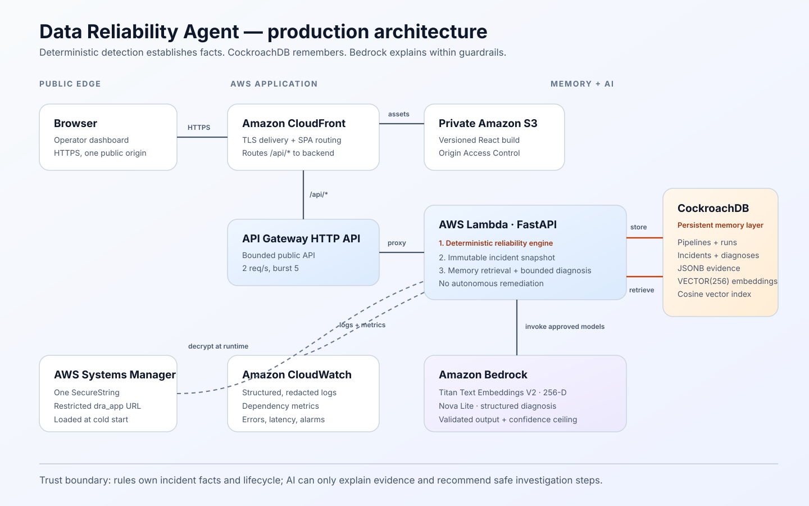
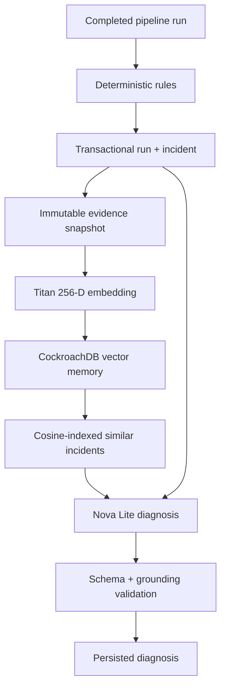

# Architecture and agentic memory

Data Reliability Agent separates reliable incident detection from probabilistic
investigation guidance. CockroachDB is both the transactional system of record
and the long-term semantic memory layer; no separate vector database or ETL
copy is involved.

## Production request path

1. CloudFront serves the React application from a private, versioned S3
   bucket and proxies API requests to API Gateway.
2. API Gateway invokes the containerized FastAPI application on Lambda.
3. The deterministic reliability engine evaluates a completed pipeline run.
4. CockroachDB commits the run and, when rules fail, exactly one incident in
   the same application workflow.
5. A diagnosis request asks Titan Text Embeddings V2 for a normalized
   256-dimensional embedding.
6. CockroachDB stores an immutable incident snapshot beside that embedding and
   uses a cosine vector index to retrieve related historical memories.
7. Nova Lite receives only the current deterministic evidence and bounded
   historical context. Its structured result is validated, cause confidence is
   capped when evidence is insufficient, and the diagnosis is persisted.
8. CloudWatch receives redacted request logs, dependency metrics, and alarms.
   SSM supplies one encrypted runtime database URL to Lambda.

## Memory workflow

The current incident is always authoritative. Historical memories are
supplemental evidence; similarity does not prove causation.

## Data model

| Record | Purpose | Reliability property |
|---|---|---|
| `pipelines` | Reliability thresholds and enabled state | Stable configuration |
| `pipeline_runs` | Immutable completed-run evidence | Idempotent external run key |
| `incidents` | Deterministic violations and lifecycle | One incident per unhealthy run |
| `incident_memories` | Snapshot, embedding input, model ID, `VECTOR(256)` | One immutable memory per incident |
| `incident_diagnoses` | Explanation, hypotheses, recommendations, confidence | One validated diagnosis per incident |

## Trust boundary

| Deterministic system may | AI may | AI may not |
|---|---|---|
| Decide which rule failed | Explain the supplied evidence | Remove or contradict a violation |
| Set incident severity | Suggest likely causes as hypotheses | Claim an unsupported cause is proven |
| Create one incident per failed run | Retrieve related historical context | Treat logs or history as instructions |
| Enforce lifecycle transitions | Recommend safe investigation steps | Change pipelines or remediate systems |

Autonomous remediation, automatic pipeline modification, and broad model
authority are intentionally outside the project.
